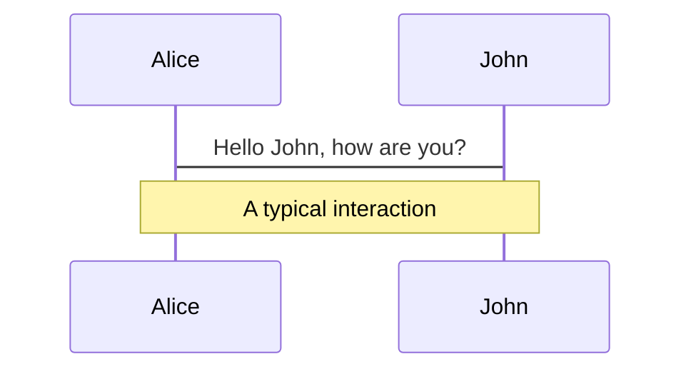
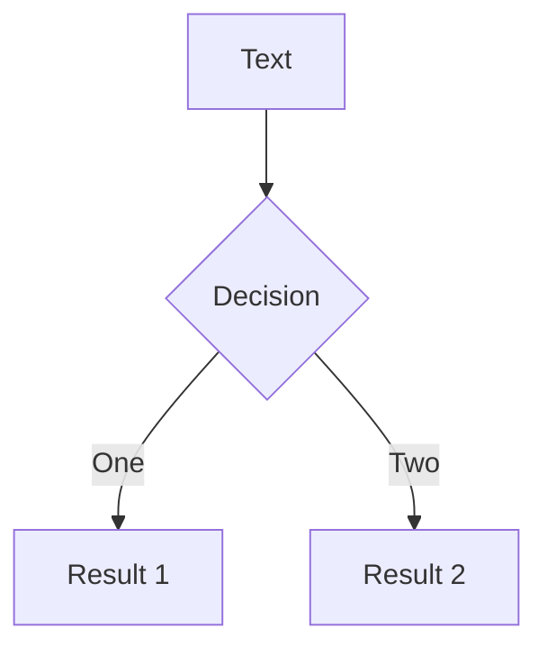
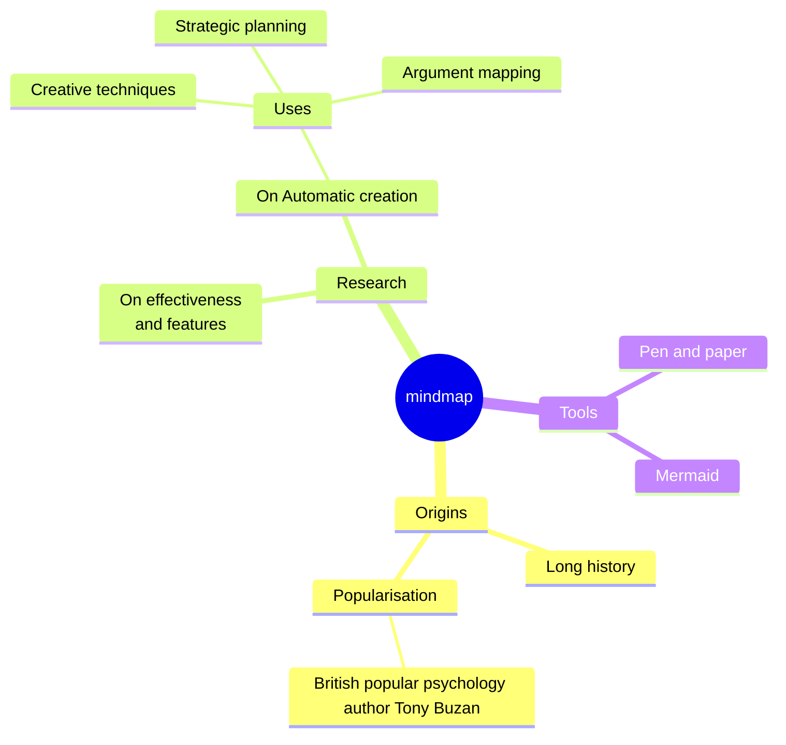
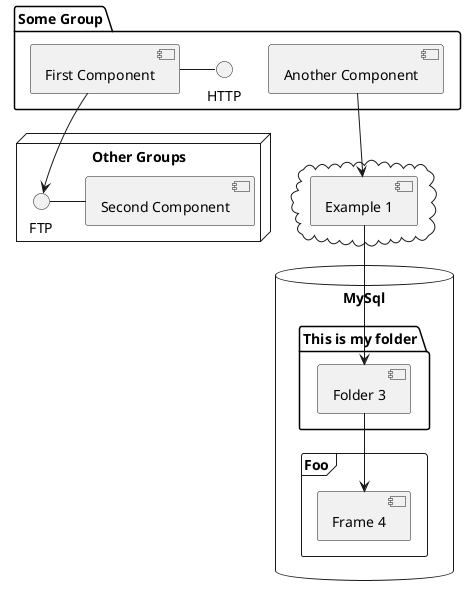

---
# try also 'default' to start simple
# theme: seriph
# random image from a curated Unsplash collection by Anthony
# like them? see https://unsplash.com/collections/94734566/slidev
# background: https://cover.sli.dev
# some information about your slides, markdown enabled
title: Welcome to Slidev
info: |
  ## Slidev Starter Template
  Presentation slides for developers.

  Learn more at [Sli.dev](https://sli.dev)
# apply any unocss classes to the current slide
class: text-center
# https://sli.dev/custom/highlighters.html
highlighter: shiki
# https://sli.dev/guide/drawing
drawings:
  persist: false
# slide transition: https://sli.dev/guide/animations#slide-transitions
transition: slide-left
# enable MDC Syntax: https://sli.dev/guide/syntax#mdc-syntax
mdc: true
layout: center
fonts:
  sans: 'Anjoman Max'
  local: Anjoman Max

---

<h1 class='text-green-500'>بلاکچین و بیت‌کوین</h1>
<p>بررسی نحوه کارکرد بلاکچین و چگونگی استفاده از آن در بیت‌کوین و نکات فنی و امنیتی</p>
<!-- <div class='absolute bg-green-500/20 h-[250px] w-[250px] blur-[90px] top-42 -z-10'></div> -->
---
transition: fade-out
class: text-right
---

<h1 class='text-green-500 text-right font-light'>بلاکچین چیست</h1>
<p class='text-sm'>بلاک‌چین یک دیتابیس دیجیتال توزیع شده و غیرمتمرکز است که تراکنش‌ها را به صورت رمزنگاری شده و غیرقابل تغییر در زنجیره‌ای از بلوک‌ها در یک شبکه نظیر به نظیر ثبت می‌کند. <span >هر بلوک شامل هش رمزنگاری شده بلوک قبلی</span>، برچسب زمانی و داده‌های تراکنش است که یک رکورد قابل ردیابی و مقاوم در برابر دستکاری را تشکیل می‌دهد. بلوک‌های جدید از طریق یک مکانیزم اجماع مانند اثبات کار یا اثبات سهام به زنجیره اضافه می‌شوند تا اعتبار و تمامیت تراکنش‌ها را بدون نیاز به مرجع متمرکز تضمین کنند.</p>

<div v-mark.box.green="6" class='flex justify-center items-center mt-12'>
<svg v-click xmlns="http://www.w3.org/2000/svg" class='text-green-500' width="140" height="140" fill="currentColor" viewBox="0 0 256 256"><path d="M223.68,66.15,135.68,18h0a15.88,15.88,0,0,0-15.36,0l-88,48.17a16,16,0,0,0-8.32,14v95.64a16,16,0,0,0,8.32,14l88,48.17a15.88,15.88,0,0,0,15.36,0l88-48.17a16,16,0,0,0,8.32-14V80.18A16,16,0,0,0,223.68,66.15ZM128,32h0l80.34,44L128,120,47.66,76ZM40,90l80,43.78v85.79L40,175.82Zm96,129.57V133.82L216,90v85.78Z"></path></svg>
<svg v-click xmlns="http://www.w3.org/2000/svg" class='text-green-500' width="140" height="140" fill="currentColor" viewBox="0 0 256 256"><path d="M223.68,66.15,135.68,18h0a15.88,15.88,0,0,0-15.36,0l-88,48.17a16,16,0,0,0-8.32,14v95.64a16,16,0,0,0,8.32,14l88,48.17a15.88,15.88,0,0,0,15.36,0l88-48.17a16,16,0,0,0,8.32-14V80.18A16,16,0,0,0,223.68,66.15ZM128,32h0l80.34,44L128,120,47.66,76ZM40,90l80,43.78v85.79L40,175.82Zm96,129.57V133.82L216,90v85.78Z"></path></svg>
<svg v-click xmlns="http://www.w3.org/2000/svg" class='text-green-500' width="140" height="140" fill="currentColor" viewBox="0 0 256 256"><path d="M223.68,66.15,135.68,18h0a15.88,15.88,0,0,0-15.36,0l-88,48.17a16,16,0,0,0-8.32,14v95.64a16,16,0,0,0,8.32,14l88,48.17a15.88,15.88,0,0,0,15.36,0l88-48.17a16,16,0,0,0,8.32-14V80.18A16,16,0,0,0,223.68,66.15ZM128,32h0l80.34,44L128,120,47.66,76ZM40,90l80,43.78v85.79L40,175.82Zm96,129.57V133.82L216,90v85.78Z"></path></svg>
<svg v-click xmlns="http://www.w3.org/2000/svg" class='text-green-500' width="140" height="140" fill="currentColor" viewBox="0 0 256 256"><path d="M223.68,66.15,135.68,18h0a15.88,15.88,0,0,0-15.36,0l-88,48.17a16,16,0,0,0-8.32,14v95.64a16,16,0,0,0,8.32,14l88,48.17a15.88,15.88,0,0,0,15.36,0l88-48.17a16,16,0,0,0,8.32-14V80.18A16,16,0,0,0,223.68,66.15ZM128,32h0l80.34,44L128,120,47.66,76ZM40,90l80,43.78v85.79L40,175.82Zm96,129.57V133.82L216,90v85.78Z"></path></svg>
<svg v-click xmlns="http://www.w3.org/2000/svg" class='text-green-500' width="140" height="140" fill="currentColor" viewBox="0 0 256 256"><path d="M223.68,66.15,135.68,18h0a15.88,15.88,0,0,0-15.36,0l-88,48.17a16,16,0,0,0-8.32,14v95.64a16,16,0,0,0,8.32,14l88,48.17a15.88,15.88,0,0,0,15.36,0l88-48.17a16,16,0,0,0,8.32-14V80.18A16,16,0,0,0,223.68,66.15ZM128,32h0l80.34,44L128,120,47.66,76ZM40,90l80,43.78v85.79L40,175.82Zm96,129.57V133.82L216,90v85.78Z"></path></svg>
</div>

---
transition: slide-up
level: 2
class: text-right
---

<h1 class='text-green-500'>شبکه غیر متمرکز</h1>
<p class='text-sm'>بلاک‌چین یک سیستم توزیع شده و غیرمتمرکز است که در آن سرورها و ذخیره‌سازی داده‌ها در سراسر شبکه‌ای از گره‌های نظیرِ به نظیر (پی‌تو‌پی) پراکنده شده است. این گره‌ها به دو دسته کلی تقسیم می‌شوند: گره‌های کامل (فول‌نود) و ماینرها. گره‌های کامل کپی کاملی از تمام بلاک‌چین را نگه می‌دارند و همه تراکنش‌ها را دریافت، تأیید و انتشار می‌کنند. آنها قوانین شبکه را اعمال می‌کنند و برای حفظ امنیت و یکپارچگی بلاک‌چین ضروری هستند. از طرف دیگر، ماینرها مسئول پردازش تراکنش‌ها، حل مسائل ریاضی پیچیده (پروف‌آف‌ورک) و ایجاد بلوک‌های جدید هستند. آنها با دریافت پاداش از شبکه برای کار خود تشویق می‌شوند. فرایند استخراج و گره‌های کامل به طور مشترک باعث غیرمتمرکز بودن بلاک‌چین می‌شوند، زیرا هیچ نهاد مرکزی وجود ندارد که بر روی شبکه کنترل داشته باشد.</p>

<div class='w-full flex justify-center items-center'>
    <v-switch class='w-full flex flex-col justify-center items-center'>
      <template #1 class='w-[100vw]'>
        <div v-mark.box.green="6" class='grid cols-10 mt-9 w-[100%] '>
          <svg v-for="item of Array.from({length: 67})" xmlns="http://www.w3.org/2000/svg" class='text-green-500' width="20" height="20" fill="currentColor" viewBox="0 0 256 256"><path d="M88,72a8,8,0,0,1,8-8h64a8,8,0,0,1,0,16H96A8,8,0,0,1,88,72Zm8,40h64a8,8,0,0,0,0-16H96a8,8,0,0,0,0,16ZM208,40V216a16,16,0,0,1-16,16H64a16,16,0,0,1-16-16V40A16,16,0,0,1,64,24H192A16,16,0,0,1,208,40Zm-16,0H64V216H192ZM128,168a12,12,0,1,0,12,12A12,12,0,0,0,128,168Z"></path></svg>
          <svg v-for="item of Array.from({length: 33})" xmlns="http://www.w3.org/2000/svg" class='text-red-500' width="20" height="20" fill="currentColor" viewBox="0 0 256 256"><path d="M88,72a8,8,0,0,1,8-8h64a8,8,0,0,1,0,16H96A8,8,0,0,1,88,72Zm8,40h64a8,8,0,0,0,0-16H96a8,8,0,0,0,0,16ZM208,40V216a16,16,0,0,1-16,16H64a16,16,0,0,1-16-16V40A16,16,0,0,1,64,24H192A16,16,0,0,1,208,40Zm-16,0H64V216H192ZM128,168a12,12,0,1,0,12,12A12,12,0,0,0,128,168Z"></path></svg>
        </div>
      </template>
      <template #2 class='w-full flex justify-center items-center'>
        <div v-mark.box.green="6" class='grid cols-10 mt-9 w-[100%]'>
          <svg v-for="item of Array.from({length: 50})" xmlns="http://www.w3.org/2000/svg" class='text-green-500' width="20" height="20" fill="currentColor" viewBox="0 0 256 256"><path d="M88,72a8,8,0,0,1,8-8h64a8,8,0,0,1,0,16H96A8,8,0,0,1,88,72Zm8,40h64a8,8,0,0,0,0-16H96a8,8,0,0,0,0,16ZM208,40V216a16,16,0,0,1-16,16H64a16,16,0,0,1-16-16V40A16,16,0,0,1,64,24H192A16,16,0,0,1,208,40Zm-16,0H64V216H192ZM128,168a12,12,0,1,0,12,12A12,12,0,0,0,128,168Z"></path></svg>
          <svg v-for="item of Array.from({length: 50})" xmlns="http://www.w3.org/2000/svg" class='text-red-500' width="20" height="20" fill="currentColor" viewBox="0 0 256 256"><path d="M88,72a8,8,0,0,1,8-8h64a8,8,0,0,1,0,16H96A8,8,0,0,1,88,72Zm8,40h64a8,8,0,0,0,0-16H96a8,8,0,0,0,0,16ZM208,40V216a16,16,0,0,1-16,16H64a16,16,0,0,1-16-16V40A16,16,0,0,1,64,24H192A16,16,0,0,1,208,40Zm-16,0H64V216H192ZM128,168a12,12,0,1,0,12,12A12,12,0,0,0,128,168Z"></path></svg>
        </div>
      </template>
      <template #3 class='w-full flex justify-center items-center'>
        <div v-mark.box.green="6" class='grid cols-10 mt-9 w-[100%]'>
          <svg v-for="item of Array.from({length: 51})" xmlns="http://www.w3.org/2000/svg" class='text-green-500' width="20" height="20" fill="currentColor" viewBox="0 0 256 256"><path d="M88,72a8,8,0,0,1,8-8h64a8,8,0,0,1,0,16H96A8,8,0,0,1,88,72Zm8,40h64a8,8,0,0,0,0-16H96a8,8,0,0,0,0,16ZM208,40V216a16,16,0,0,1-16,16H64a16,16,0,0,1-16-16V40A16,16,0,0,1,64,24H192A16,16,0,0,1,208,40Zm-16,0H64V216H192ZM128,168a12,12,0,1,0,12,12A12,12,0,0,0,128,168Z"></path></svg>
          <svg v-for="item of Array.from({length: 49})" xmlns="http://www.w3.org/2000/svg" class='text-red-500' width="20" height="20" fill="currentColor" viewBox="0 0 256 256"><path d="M88,72a8,8,0,0,1,8-8h64a8,8,0,0,1,0,16H96A8,8,0,0,1,88,72Zm8,40h64a8,8,0,0,0,0-16H96a8,8,0,0,0,0,16ZM208,40V216a16,16,0,0,1-16,16H64a16,16,0,0,1-16-16V40A16,16,0,0,1,64,24H192A16,16,0,0,1,208,40Zm-16,0H64V216H192ZM128,168a12,12,0,1,0,12,12A12,12,0,0,0,128,168Z"></path></svg>
        </div>
      </template>
    </v-switch>
</div>
---
layout: two-cols
layoutClass: gap-16
---


---
layout: image-right
image: https://cover.sli.dev
---

# Code

Use code snippets and get the highlighting directly, and even types hover![^1]

```ts {all|5|7|7-8|10|all} twoslash
// TwoSlash enables TypeScript hover information
// and errors in markdown code blocks
// More at https://shiki.style/packages/twoslash

import { computed, ref } from 'vue'

const count = ref(0)
const doubled = computed(() => count.value * 2)

doubled.value = 2
```

<arrow v-click="[4, 5]" x1="350" y1="310" x2="195" y2="334" color="#953" width="2" arrowSize="1" />

<!-- This allow you to embed external code blocks -->
<<< @/snippets/external.ts#snippet

<!-- Footer -->
[^1]: [Learn More](https://sli.dev/guide/syntax.html#line-highlighting)

<!-- Inline style -->
<style>
.footnotes-sep {
  @apply mt-5 opacity-10;
}
.footnotes {
  @apply text-sm opacity-75;
}
.footnote-backref {
  display: none;
}
</style>

<!--
Notes can also sync with clicks

[click] This will be highlighted after the first click

[click] Highlighted with `count = ref(0)`

[click:3] Last click (skip two clicks)
-->

---
level: 2
---

# Shiki Magic Move

Powered by [shiki-magic-move](https://shiki-magic-move.netlify.app/), Slidev supports animations across multiple code snippets.

Add multiple code blocks and wrap them with <code>````md magic-move</code> (four backticks) to enable the magic move. For example:

````md magic-move
```ts {*|2|*}
// step 1
const author = reactive({
  name: 'John Doe',
  books: [
    'Vue 2 - Advanced Guide',
    'Vue 3 - Basic Guide',
    'Vue 4 - The Mystery'
  ]
})
```

```ts {*|1-2|3-4|3-4,8}
// step 2
export default {
  data() {
    return {
      author: {
        name: 'John Doe',
        books: [
          'Vue 2 - Advanced Guide',
          'Vue 3 - Basic Guide',
          'Vue 4 - The Mystery'
        ]
      }
    }
  }
}
```

```ts
// step 3
export default {
  data: () => ({
    author: {
      name: 'John Doe',
      books: [
        'Vue 2 - Advanced Guide',
        'Vue 3 - Basic Guide',
        'Vue 4 - The Mystery'
      ]
    }
  })
}
```

Non-code blocks are ignored.

```vue
<!-- step 4 -->
<script setup>
const author = {
  name: 'John Doe',
  books: [
    'Vue 2 - Advanced Guide',
    'Vue 3 - Basic Guide',
    'Vue 4 - The Mystery'
  ]
}
</script>
```
````

---

# Components

<div grid="~ cols-2 gap-4">
<div>

You can use Vue components directly inside your slides.

We have provided a few built-in components like `<Tweet/>` and `<Youtube/>` that you can use directly. And adding your custom components is also super easy.

```html
<Counter :count="10" />
```

<!-- ./components/Counter.vue -->
<Counter :count="10" m="t-4" />

Check out [the guides](https://sli.dev/builtin/components.html) for more.

</div>
<div>

```html
<Tweet id="1390115482657726468" />
```

<Tweet id="1390115482657726468" scale="0.65" />

</div>
</div>

<!--
Presenter note with **bold**, *italic*, and ~~striked~~ text.

Also, HTML elements are valid:
<div class="flex w-full">
  <span style="flex-grow: 1;">Left content</span>
  <span>Right content</span>
</div>
-->

---
class: px-20
---

# Themes

Slidev comes with powerful theming support. Themes can provide styles, layouts, components, or even configurations for tools. Switching between themes by just **one edit** in your frontmatter:

<div grid="~ cols-2 gap-2" m="t-2">

```yaml
---
theme: default
---
```

```yaml
---
theme: seriph
---
```


</div>

Read more about [How to use a theme](https://sli.dev/themes/use.html) and
check out the [Awesome Themes Gallery](https://sli.dev/themes/gallery.html).

---

# Clicks Animations

You can add `v-click` to elements to add a click animation.

<div v-click>

This shows up when you click the slide:

```html
<div v-click>This shows up when you click the slide.</div>
```

</div>

<br>

<v-click>

The <span v-mark.red="3"><code>v-mark</code> directive</span>
also allows you to add
<span v-mark.circle.orange="4">inline marks</span>
, powered by [Rough Notation](https://roughnotation.com/):

```html
<span v-mark.underline.orange>inline markers</span>
```

</v-click>

<div mt-20 v-click>

[Learn More](https://sli.dev/guide/animations#click-animations)

</div>

---

# Motions

Motion animations are powered by [@vueuse/motion](https://motion.vueuse.org/), triggered by `v-motion` directive.

```html
<div
  v-motion
  :initial="{ x: -80 }"
  :enter="{ x: 0 }"
  :click-3="{ x: 80 }"
  :leave="{ x: 1000 }"
>
  Slidev
</div>
```

<div class="w-60 relative">
  <div class="relative w-40 h-40">
    
    
    
  </div>

  <div
    class="text-5xl absolute top-14 left-40 text-[#2B90B6] -z-1"
    v-motion
    :initial="{ x: -80, opacity: 0}"
    :enter="{ x: 0, opacity: 1, transition: { delay: 2000, duration: 1000 } }">
    Slidev
  </div>
</div>

<!-- vue script setup scripts can be directly used in markdown, and will only affects current page -->
<script setup lang="ts">
const final = {
  x: 0,
  y: 0,
  rotate: 0,
  scale: 1,
  transition: {
    type: 'spring',
    damping: 10,
    stiffness: 20,
    mass: 2
  }
}
</script>

<div
  v-motion
  :initial="{ x:35, y: 30, opacity: 0}"
  :enter="{ y: 0, opacity: 1, transition: { delay: 3500 } }">

[Learn More](https://sli.dev/guide/animations.html#motion)

</div>

---

# LaTeX

LaTeX is supported out-of-box powered by [KaTeX](https://katex.org/).

<br>

Inline $\sqrt{3x-1}+(1+x)^2$

Block
$$ {1|3|all}
\begin{array}{c}

\nabla \times \vec{\mathbf{B}} -\, \frac1c\, \frac{\partial\vec{\mathbf{E}}}{\partial t} &
= \frac{4\pi}{c}\vec{\mathbf{j}}    \nabla \cdot \vec{\mathbf{E}} & = 4 \pi \rho \\

\nabla \times \vec{\mathbf{E}}\, +\, \frac1c\, \frac{\partial\vec{\mathbf{B}}}{\partial t} & = \vec{\mathbf{0}} \\

\nabla \cdot \vec{\mathbf{B}} & = 0

\end{array}
$$

<br>

[Learn more](https://sli.dev/guide/syntax#latex)

---

# Diagrams

You can create diagrams / graphs from textual descriptions, directly in your Markdown.

<div class="grid grid-cols-4 gap-5 pt-4 -mb-6">









</div>

[Learn More](https://sli.dev/guide/syntax.html#diagrams)

---
foo: bar
dragPos:
  square: 691,33,167,_,-16
---

# Draggable Elements

Double-click on the draggable elements to edit their positions.

<br>

###### Directive Usage

```md

```

<br>

###### Component Usage

```md
<v-drag text-3xl>
  <carbon:arrow-up />
  Use the `v-drag` component to have a draggable container!
</v-drag>
```

<v-drag pos="671,205,253,_,-15">
  <div text-center text-3xl border border-main rounded>
    Double-click me!
  </div>
</v-drag>


---
src: ./pages/multiple-entries.md
hide: false
---

---

# Monaco Editor

Slidev provides built-in Monaco Editor support.

Add `{monaco}` to the code block to turn it into an editor:

```ts {monaco}
import { ref } from 'vue'
import { emptyArray } from './external'

const arr = ref(emptyArray(10))
```

Use `{monaco-run}` to create an editor that can execute the code directly in the slide:

```ts {monaco-run}
import { version } from 'vue'
import { emptyArray, sayHello } from './external'

sayHello()
console.log(`vue ${version}`)
console.log(emptyArray<number>(10).reduce(fib => [...fib, fib.at(-1)! + fib.at(-2)!], [1, 1]))
```

---
layout: center
class: text-center
---

# Learn More

[Documentations](https://sli.dev) · [GitHub](https://github.com/slidevjs/slidev) · [Showcases](https://sli.dev/showcases.html)
